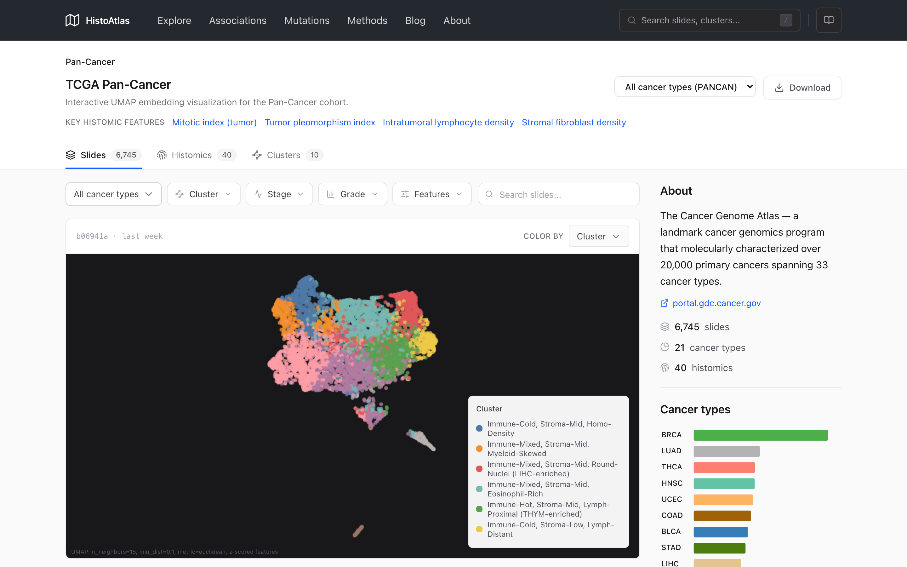
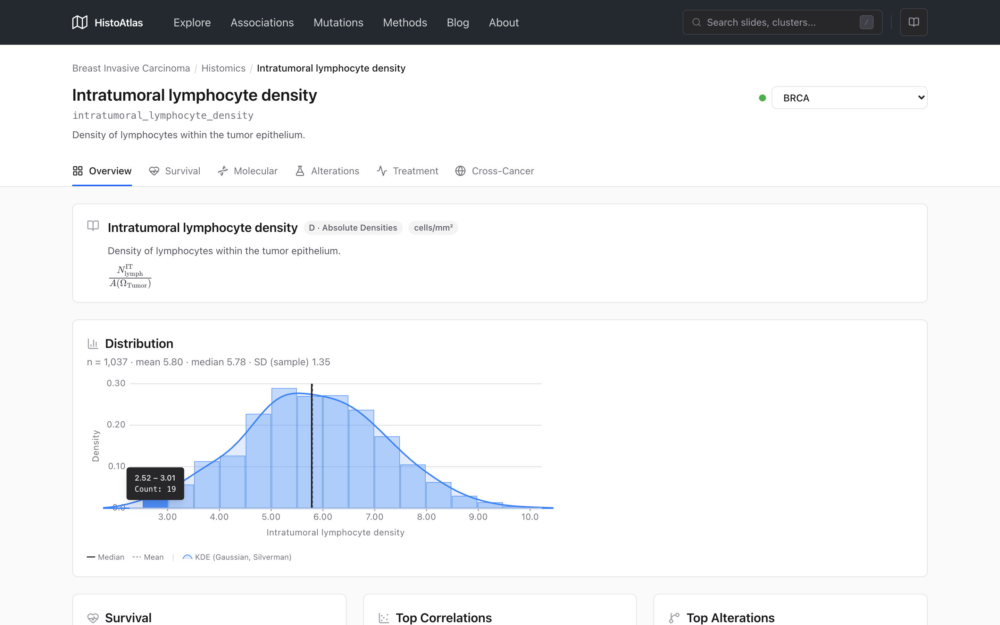
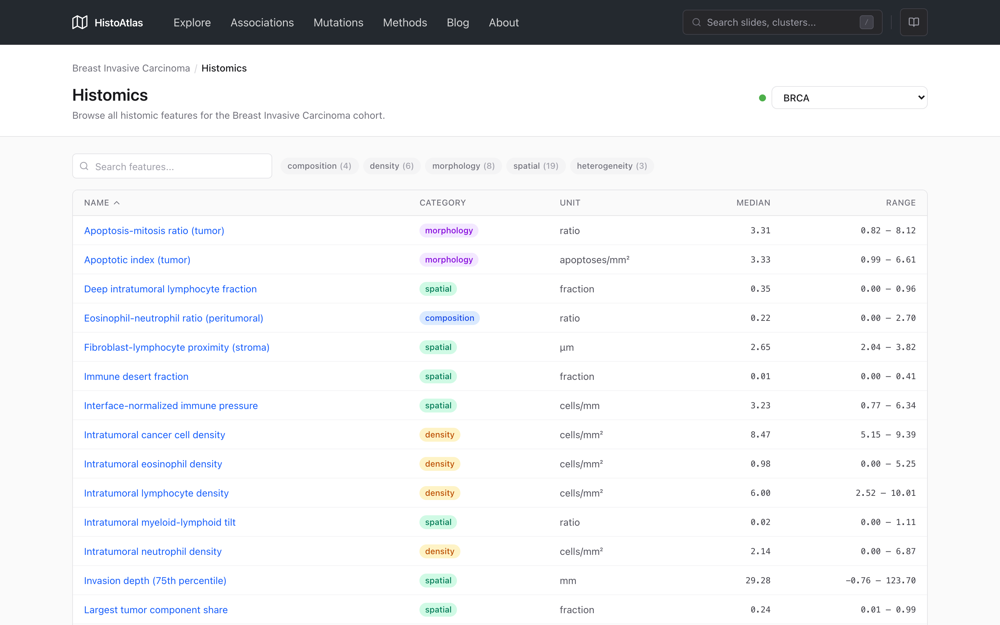
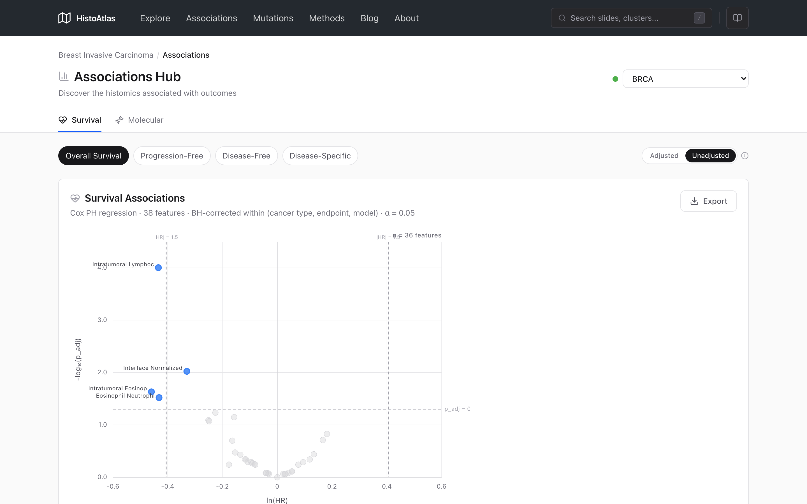
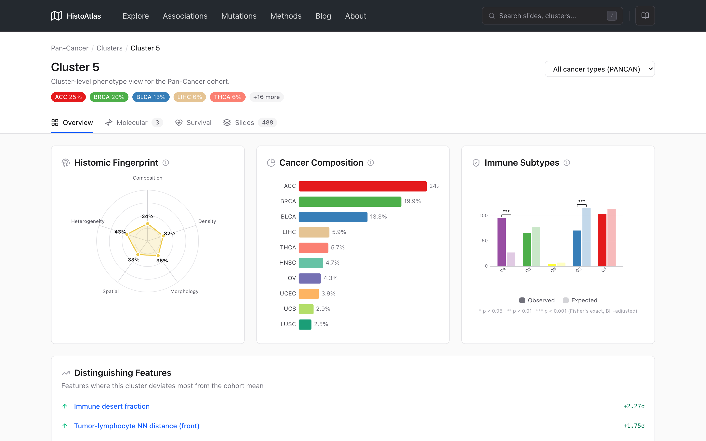
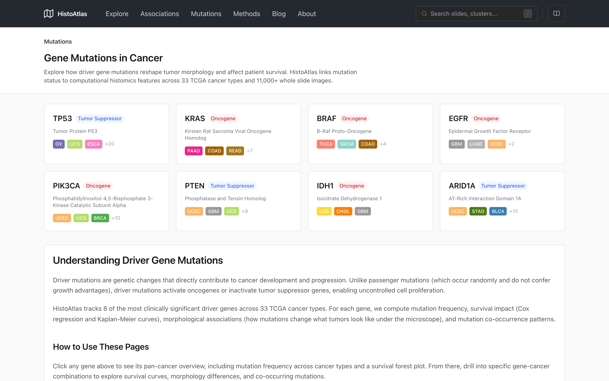
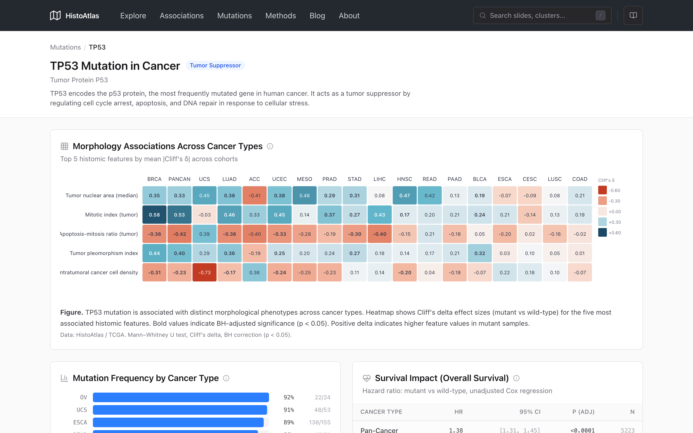

<p align="center">
  
</p>

<h1 align="center">HistoAtlas</h1>

<p align="center">
  A pan-cancer computational histopathology atlas linking tissue morphology to molecular programs and clinical outcomes.
</p>

<p align="center">
  <a href="https://arxiv.org/abs/2603.16587"></a>
  <a href="https://histoatlas.com"></a>
  <a href="https://www.python.org/downloads/"></a>
  <a href="LICENSE"></a>
</p>

---

## Overview

HistoAtlas quantifies the tumor microenvironment from H&E-stained whole-slide images across 33 TCGA cancer types (9,000+ slides) and validates findings on CPTAC. Starting from automated cell segmentation, it extracts 38 interpretable histomic features capturing cellular composition, spatial organization, nuclear morphology, and tissue architecture. These features are then systematically tested for associations with gene expression, mutations, copy-number variation, immune subtypes, pathway activity, and patient survival.

The project includes:

- **`histoatlas/`** : a Python library for survival analysis, molecular correlations, clustering, and statistical validation
- **`scripts/`** : reproducible analysis and data preparation scripts
- **`workflow/`** : a Snakemake pipeline orchestrating the full analysis DAG
- **`web/`** : an interactive Astro + React frontend for exploring the atlas at [histoatlas.com](https://histoatlas.com)

<p align="center">
  
</p>

## Key capabilities

- **Survival analysis**: Cox proportional hazards (unadjusted and adjusted for age, sex, stage), Kaplan-Meier curves, restricted mean survival time (RMST)
- **Molecular correlations**: Spearman correlations with mRNA, protein (CPTAC), CNV, immune scores, and Hallmark pathway scores
- **Morphology-based clustering**: K-means on histomic features with bootstrap stability, UMAP embeddings, cluster-level molecular enrichment
- **Statistical rigor**: Benjamini-Hochberg FDR correction, minimum detectable effect size (MDES), permutation null models, endpoint concordance checks
- **Quality control**: Batch effect detection (PVCA), segmentation quality metrics, feature redundancy analysis, sample-level QC flags

## Installation

HistoAtlas requires Python 3.10 to 3.12 and uses [uv](https://docs.astral.sh/uv/) as its package manager.

```bash
# Clone the repository
git clone https://github.com/HistoAtlas/HistoAtlas.git
cd HistoAtlas

# Install dependencies
uv sync

# (Optional) Install workflow extras for Snakemake (requires Python >= 3.11)
uv sync --extra workflow

# (Optional) Install dev extras for linting and testing
uv sync --extra dev
```

## Quickstart

### Running analyses

Each script in `scripts/analyses/` performs one self-contained analysis step, reading from and writing to `data/` as parquet files.

```bash
# Example: compute survival associations for all features and cancer types
uv run python scripts/analyses/compute_survival.py

# Example: compute molecular correlations
uv run python scripts/analyses/compute_molecular_correlations.py
```

### Running the full pipeline

The Snakemake workflow orchestrates all analysis scripts as a directed acyclic graph (DAG).

```bash
# Dry-run: validate the DAG without executing
uv run snakemake --cores 1 -n

# Run the full pipeline
uv run snakemake --cores 8

# Run in dry-run mode (subset of data, ~5 min)
uv run snakemake --cores 4 --config dry_run=true
```

### Running the web app locally

```bash
cd web
npm install
npm run dev        # Starts on http://localhost:4321
```

> The frontend reads pre-generated static JSON from `web/public/api/`. To populate this data, run `uv run python scripts/analyses/export_frontend_json.py` after the pipeline completes.

## Repository structure

```
histoatlas/                    # Core Python library
  analysis/                    #   Statistical analysis (power, evidence, batch effects)
  cluster/                     #   Clustering (K-means, UMAP, bootstrap stability)
  config/                      #   Configuration (gene sets, feature metadata, thresholds)
  frontend/                    #   Frontend JSON export functions
  molecular/                   #   Molecular correlations, enrichment, categorical tests
  qc/                          #   Quality control (flags, segmentation QC)
  survival/                    #   Cox regression, Kaplan-Meier, RMST

scripts/
  analyses/                    # Analysis scripts (one per analysis unit)
  data/                        # Data download and preparation scripts

workflow/                      # Snakemake pipeline
  Snakefile                    #   Main entrypoint
  config/                      #   Pipeline configuration (datasets, parameters)
  rules/                       #   Rule modules (.smk files)

web/                           # Interactive frontend (Astro + React)
  src/
    components/                #   React components
    pages/                     #   Astro route entrypoints
    islands/                   #   Hydrated React islands
    hooks/                     #   Data fetching hooks
    api/                       #   API client and path definitions
```

## Data

HistoAtlas uses publicly available data from [TCGA](https://portal.gdc.cancer.gov/) and [CPTAC](https://proteomics.cancer.gov/programs/cptac):

| Modality | TCGA | CPTAC |
|---|---|---|
| Histomics | 9,028 slides, 38 features | 1,850 slides, 38 features |
| Gene expression | 10,071 samples | 1,092 samples |
| Proteomics | -- | 1,017 samples |
| Mutations | 9,104 samples (MC3) | -- |
| CNV | 10,845 samples (GISTIC2) | -- |
| Clinical/survival | 10,953 patients | 1,850 patients |

Data download scripts are provided in `scripts/data/`. All scripts pull from public APIs (GDC, Xena, LinkedOmics) and require no authentication.

## Screenshots

<details>
<summary><b>Atlas UMAP embedding</b></summary>

</details>

<details>
<summary><b>Cohort overview</b></summary>

</details>

<details>
<summary><b>Histomic feature detail</b></summary>

</details>

<details>
<summary><b>Associations hub</b></summary>

</details>

<details>
<summary><b>Cluster detail</b></summary>

</details>

<details>
<summary><b>Mutation landscape</b></summary>

</details>

<details>
<summary><b>Mutation detail</b></summary>

</details>

## Citation

If you use HistoAtlas in your research, please cite:

```bibtex
@misc{bannier2026histoatlas,
  title         = {HistoAtlas: A Pan-Cancer Morphology Atlas Linking Histomics
                   to Molecular Programs and Clinical Outcomes},
  author        = {Pierre-Antoine Bannier},
  year          = {2026},
  eprint        = {2603.16587},
  archivePrefix = {arXiv},
  primaryClass  = {q-bio.QM},
  url           = {https://arxiv.org/abs/2603.16587}
}
```

## License

This project is licensed under [CC BY-NC 4.0](LICENSE). You are free to share and adapt the material for non-commercial purposes with appropriate attribution.

The underlying TCGA and CPTAC data are subject to their respective [GDC Data Use Policies](https://gdc.cancer.gov/about-gdc/gdc-policies).
